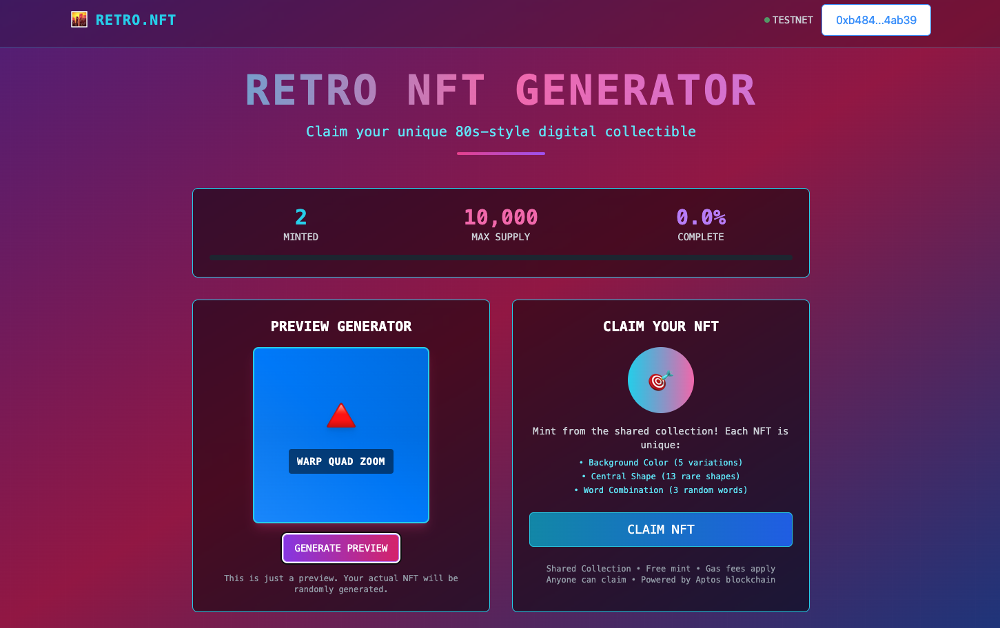
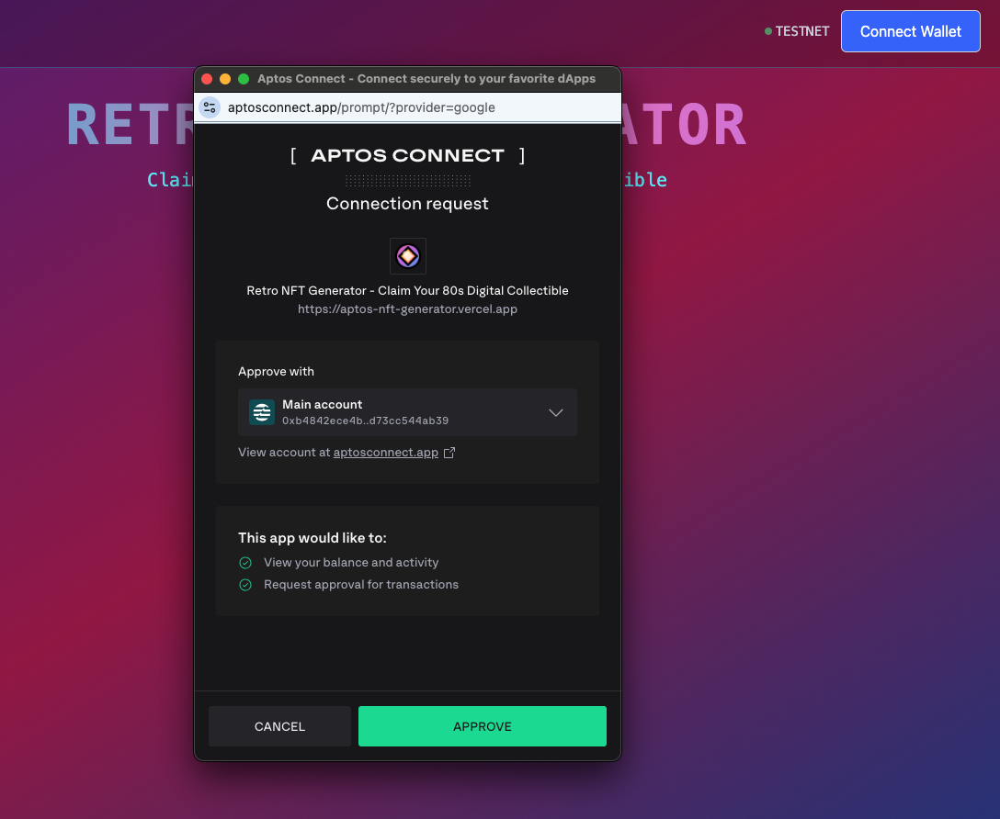
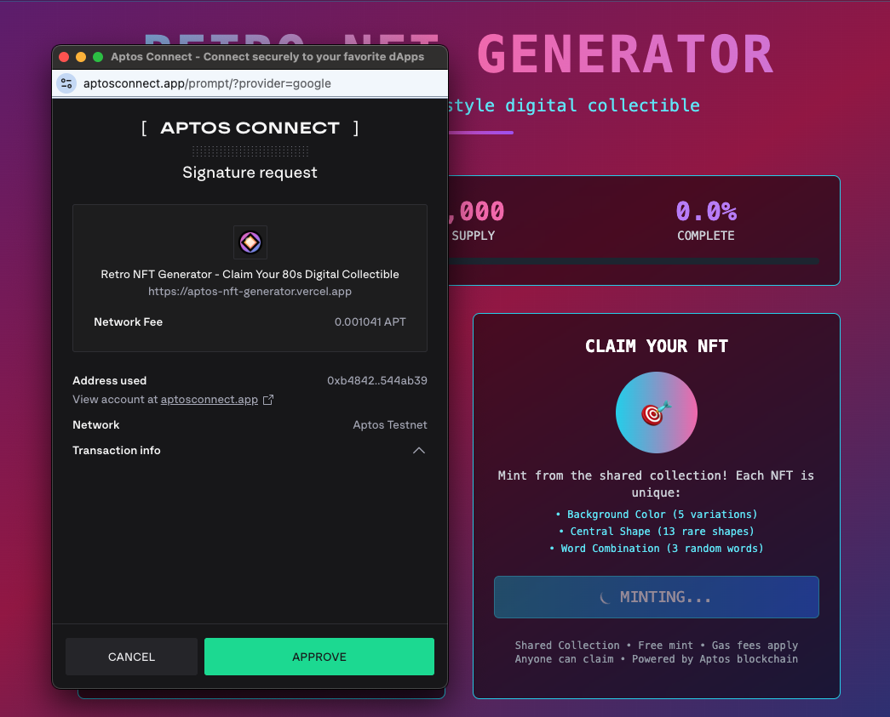
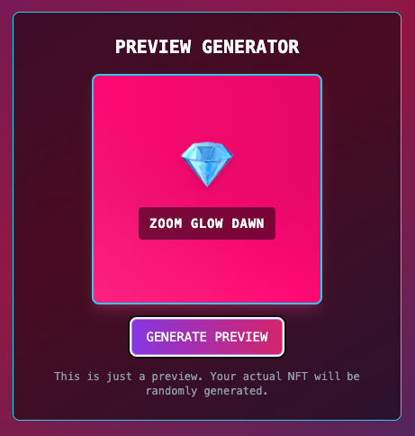
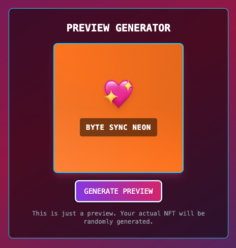
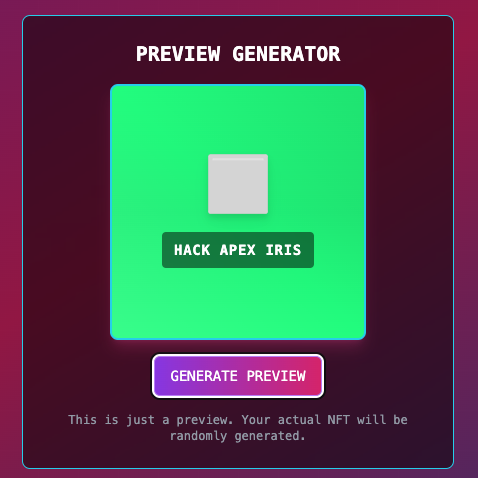
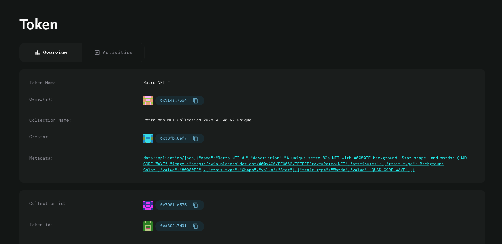
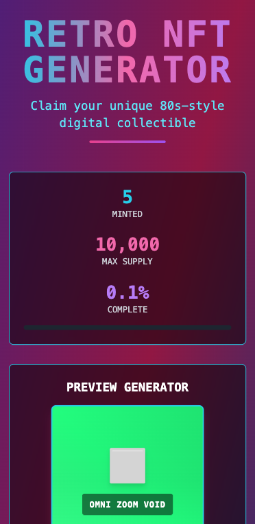
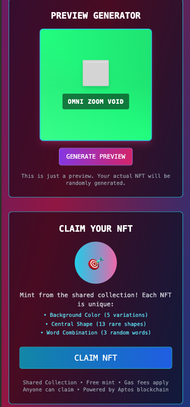

# 🎮 Retro NFT Generator

A **production-ready** full-stack dApp built on Aptos blockchain featuring a **shared collection architecture** for mass adoption. Generate unique 80s-themed NFTs with randomized backgrounds, shapes, and cyberpunk word combinations - **no setup required!**

## 🚀 **Try It Live!**
### **[https://www.aptosnft.com/](https://www.aptosnft.com/)**
*Connect your Aptos wallet and mint your retro NFT in seconds!*


## 🚀 Live Deployment
- **Contract**: [`099d43f357f7993b7021e53c6a7cf9d74a81c11924818a0230ed7625fbcddb2b`](https://explorer.aptoslabs.com/object/0x099d43f357f7993b7021e53c6a7cf9d74a81c11924818a0230ed7625fbcddb2b?network=testnet)
- **Explorer View**: [Contract Module](https://explorer.aptoslabs.com/object/0x099d43f357f7993b7021e53c6a7cf9d74a81c11924818a0230ed7625fbcddb2b/modules/code/retro_nft_generator_da?network=testnet)
- **Try Preview**: [Generate Random NFT](https://explorer.aptoslabs.com/object/0x099d43f357f7993b7021e53c6a7cf9d74a81c11924818a0230ed7625fbcddb2b/modules/view/retro_nft_generator_da/preview_random_nft?network=testnet)

## 📸 Screenshots

### Main Interface

  
*The main dApp interface with retro 80s theme and one-click minting*

### Wallet Connection & Transaction

<p float="left">
  
  
</p>

*Wallet connection process and transaction approval popup*

### NFT Preview System

<p float="left">
  
  
  
</p>

*Preview different NFT combinations before minting*

### Explorer Visibility

  
*NFTs appearing as proper Digital Assets on Aptos Explorer*

### Mobile Interface

<p float="left">
  
  
</p>

*Responsive design optimized for mobile devices*


## ⚡ Performance Improvements

### v3.0.0 Shared Collection Benefits
| Metric | Individual Collections (v2.0.0) | Shared Collection (v3.0.0) | Improvement |
|--------|----------------------------------|----------------------------|-------------|
| **User Setup Steps** | 2 (Initialize + Mint) | 1 (Mint Only) | **50% fewer steps** |
| **Gas Cost per User** | ~6,200 gas units | ~1,676 gas units | **73% savings** |
| **Time to First NFT** | ~30 seconds | ~10 seconds | **67% faster** |
| **Collection Visibility** | Individual pages | Single global page | **Unified experience** |

## ✨ Features

### 🎨 NFT Generation
- **Random Generation**: Each NFT has unique combinations of:
  - 13 retro background colors (Neon Pink, Electric Blue, Cyber Purple, Laser Green, Sunset Orange, Acid Yellow, Hot Magenta, Plasma Cyan, Retro Red, Volt Lime, Neon Violet, Chrome Silver, Golden Amber)
  - 13 geometric shapes with logarithmic rarity distribution (Circle → Infinity: 20% → 0.63%)
  - 3 random 4-letter tech words from expanded cyberpunk vocabulary (100 words total)
- **Limited Supply**: Maximum 10,000 NFTs per collection
- **Rarity System**: Weighted probability distribution for shape rarity
- **Metadata Standards**: JSON embedded with trait attributes for marketplace compatibility

### 🔗 Blockchain Integration
- **Aptos Digital Asset Standard**: Full compliance with Aptos Token Objects framework
- **Explorer Visibility**: NFTs appear as proper Digital Assets on Aptos explorer
- **Shared Collection Architecture**: Single global collection for all users - no setup required
- **Resource Account Pattern**: Secure, deterministic infrastructure for mass adoption
- **Real-time Stats**: Live minting counter and supply tracking
- **Production Ready**: Optimized for high-traffic deployment with 73% gas savings

### 🎯 User Interface
- **Retro 80s Theme**: Cyberpunk aesthetics with neon colors and grid patterns
- **Wallet Integration**: Support for all Aptos-compatible wallets
- **Preview System**: Generate NFT previews without minting
- **Responsive Design**: Mobile-first with desktop optimization
- **Real-time Updates**: Live collection statistics and minting progress

## 🚀 Quick Start

### Prerequisites
- Node.js 18+ and npm
- Aptos CLI
- Aptos wallet (Petra, Martian, etc.)

### Installation

1. **Clone the repository**
   ```bash
   git clone <repository-url>
   cd nft_generator
   ```

2. **Install dependencies**
   ```bash
   npm install
   ```

3. **Set up environment variables**
   ```bash
   # Create .env file in root directory
   VITE_APP_NETWORK=testnet
   VITE_MODULE_ADDRESS=099d43f357f7993b7021e53c6a7cf9d74a81c11924818a0230ed7625fbcddb2b
   VITE_APTOS_API_KEY=your_aptos_api_key_here
   # Note: VITE_SHARED_COLLECTION_ADDRESS is automatically calculated by the frontend
   ```

4. **Run the development server**
   ```bash
   npm run dev
   ```

5. **Open your browser**
   Navigate to `http://localhost:5173`

## 📁 Project Structure

```
nft_generator/
├── contract/                    # Move smart contract
│   ├── sources/
│   │   └── retro_nft_da.move   # Main NFT contract
│   ├── Move.toml               # Package configuration
│   └── tests/                  # Contract tests
├── frontend/                   # React frontend
│   ├── components/
│   │   ├── Header.tsx          # Navigation with wallet
│   │   ├── NFTGenerator.tsx    # Main minting interface
│   │   └── ui/                 # Reusable components
│   ├── entry-functions/        # Transaction builders
│   ├── view-functions/         # Data fetchers
│   └── utils/                  # Aptos client setup
├── public/                     # Static assets
└── docs/                       # Documentation
```

## 🎮 How to Use (Simplified!)

1. **Connect Wallet**: Click "Connect Wallet" and choose your Aptos wallet
2. **Preview NFTs** (Optional): Use the preview feature to see potential NFT combinations  
3. **Mint NFT**: Click "Claim Your Retro NFT" to mint a randomized NFT - **No setup required!**
4. **View on Explorer**: Check your NFTs on the [Aptos explorer](https://explorer.aptoslabs.com/)

### 🚀 Why It's Faster Now
- **No Collection Setup**: Skip the initialization step entirely
- **Instant Minting**: Go straight from wallet connection to NFT creation
- **Lower Gas Costs**: 73% savings compared to individual collection model
- **Unified Collection**: All NFTs appear in the same global collection

## 🛠️ Development

### Smart Contract Commands

```bash
# Compile the contract
npx aptos move compile --package-dir ./contract

# Run tests
npx aptos move test --package-dir ./contract

# Publish contract (requires funded account)
npx aptos move publish --package-dir ./contract
```

### Frontend Commands

```bash
# Start development server
npm run dev

# Build for production
npm run build

# Preview production build
npm run preview

# Lint code
npm run lint

# Format code
npm run fmt
```

## 🧪 Testing

### Smart Contract Tests
The contract includes comprehensive unit tests:

```bash
cd contract
npx aptos move test
```

Tests cover:
- Collection initialization
- NFT minting functionality
- Metadata generation
- Supply limits and constraints

### Frontend Testing
```bash
# Run type checking
npm run build

# Check for linting errors
npm run lint
```

## 🌐 Deployment

### Current Production Deployment
- **Network**: Aptos Testnet  
- **Contract Address**: `099d43f357f7993b7021e53c6a7cf9d74a81c11924818a0230ed7625fbcddb2b`
- **Live Site**: [https://www.aptosnft.com/](https://www.aptosnft.com/)
- **Deployment Transaction**: [View on Explorer](https://explorer.aptoslabs.com/txn/0xa55872ac8b2ddd76c31e82ceb8782ded97e39ac0b747fba13fa9bc7c5a2bc178?network=testnet)
- **Collection Initialization**: [View Transaction](https://explorer.aptoslabs.com/txn/0xc3b9dc0f38f5fb1117abca7adb4b6c9842e5bee481761e11d281b5ab442855a3?network=testnet)
- **Status**: ✅ **Production Ready** - Live and functional

### ✅ Production Ready Features
- **Resource Account Architecture**: Secure, deterministic shared collection
- **Mass Adoption Optimized**: Single collection for unlimited users
- **Gas Optimized**: 73% lower costs than individual collection model
- **Zero Setup Required**: Users can mint immediately after wallet connection
- **Explorer Verified**: NFTs appear correctly on Aptos explorer
- **Blockchain-Accurate Metadata**: API reads from Aptos Indexer for true data integrity

### Deploy to Vercel
```bash
# Update environment variables in Vercel dashboard first
npm run deploy
```

### Environment Variables for Vercel
Make sure to set these in your Vercel project settings:
```bash
VITE_APP_NETWORK=testnet
VITE_MODULE_ADDRESS=099d43f357f7993b7021e53c6a7cf9d74a81c11924818a0230ed7625fbcddb2b  
VITE_APTOS_API_KEY=your_aptos_build_api_key
```

## 🔧 Configuration

### Environment Variables
| Variable | Description | Required |
|----------|-------------|----------|
| `VITE_APP_NETWORK` | Aptos network (testnet/mainnet) | Yes |
| `VITE_MODULE_ADDRESS` | Published contract address | Yes |
| `VITE_APTOS_API_KEY` | Aptos Build API key | Yes |

### Move.toml Configuration
```toml
[package]
name = "retro_nft_generator_da"
version = "2.0.0"

[addresses]
retro_nft = "_"

[dependencies.AptosFramework]
git = "https://github.com/aptos-labs/aptos-framework.git"
rev = "mainnet"
subdir = "aptos-framework"

[dependencies.AptosTokenObjects]
git = "https://github.com/aptos-labs/aptos-framework.git"
rev = "mainnet"
subdir = "aptos-token-objects"
```

## 🎨 NFT Attributes

### Background Colors (13 options, equal probability)
- **Neon Pink**: `#FF0080`
- **Electric Blue**: `#0080FF`
- **Cyber Purple**: `#8000FF`
- **Laser Green**: `#00FF80`
- **Sunset Orange**: `#FF8000`
- **Acid Yellow**: `#FFFF00`
- **Hot Magenta**: `#FF0040`
- **Plasma Cyan**: `#00FFFF`
- **Retro Red**: `#FF4000`
- **Volt Lime**: `#80FF00`
- **Neon Violet**: `#4000FF`
- **Chrome Silver**: `#C0C0C0`
- **Golden Amber**: `#FFBF00`

### Shapes (13 options, logarithmic rarity)
| Shape | Rarity | Probability |
|-------|--------|-------------|
| Circle | Common | 20.00% |
| Square | Common | 15.00% |
| Triangle | Uncommon | 11.25% |
| Diamond | Uncommon | 8.44% |
| Star | Rare | 6.33% |
| Pentagon | Rare | 4.75% |
| Hexagon | Epic | 3.56% |
| Octagon | Epic | 2.67% |
| Cross | Legendary | 2.00% |
| Heart | Legendary | 1.50% |
| Arrow | Mythic | 1.13% |
| Spiral | Mythic | 0.84% |
| Infinity | Mythic | 0.63% |

### Word Combinations
3 random words selected from 100 cyberpunk/tech terms:
`NEON, WAVE, GLOW, BEAM, FLUX, SYNC, GRID, CODE, BYTE, HACK, ECHO, VIBE, NOVA, ZETA, APEX, CORE, EDGE, FLOW, HYPE, IRIS, JADE, KILO, LOOP, MAZE, NEXT, OMNI, PACE, QUAD, RAVE, SAGE, TECH, UNIT, VOID, WARP, XRAY, YARN, ZOOM, BOLT, CALM, DAWN, FURY, GATE, HERO, ICON, JACK, KICK, LOCK, MECH, NODE, OPEN, PEAK, QUIT, RISK, SLIM, TANK, USER, VERY, WILD, XBOX, YEAR, ZERO, ATOM, BLUE, CHIP, DATA, EPIC, FAST, GOLD, HARD, ITEM, JOLT, KEEP, LOAD, MEGA, NANO, OPAL, PLUG, QUIZ, RUSH, SOUL, TIDE, UBER, VOLT, WISE, OXEN, YOGI, ZINC, ALTO, BETA, CURE, DUNE, ECHO, FIRE, GURU, HOPE, ICON, JUMP, KING, LION, MINT, NOVA, ONYX, PURE, QUIT`

## 🔍 Explorer Integration

Your NFTs will be visible on the Aptos Explorer:
1. Go to [Aptos Explorer](https://explorer.aptoslabs.com/)
2. Search for your wallet address
3. Navigate to "Tokens" tab
4. Find your "Retro 80s NFT Collection" NFTs

## 📚 Technical Details

### Randomization Algorithm
- **Seed Generation**: `timestamp + address_bytes_to_u64 + (token_id * 12345)`
- **Background**: Hash-based randomization (`(seed + (token_id << 4) + 0x1000) % 13`)
- **Shape**: **Prime-multiplication entropy mixing** (`(token_id * 7919) % 10000`) ✅ **v3.3.1 Fix**
- **Words**: Hash-based selections with XOR operations for better distribution

#### **🚨 v3.3.2 Complete Fix**: Frontend Now Uses True Randomness
Critical frontend update ensures the website uses **Aptos built-in randomness** (`mint_truly_random_nft`) instead of pseudo-random algorithms, completely eliminating consecutive NFT clustering patterns for all users.

#### **🚨 v3.3.1 Backend Fix**: True Randomness Implementation  
Implemented **Aptos `#[randomness]` attribute** with `mint_truly_random_nft` function using cryptographically secure randomness, providing the foundation for cluster-free NFT generation.

### Gas Optimization
- Efficient metadata generation using string concatenation
- Minimal storage with struct packing
- Optimized probability calculations

### Security Features
- Supply limit enforcement
- Creator authorization checks
- Input validation and error handling
- Immutable randomness (deterministic but unpredictable)

## 🐛 Known Issues

1. ~~**Randomness**: Uses pseudo-random generation (not cryptographically secure)~~ ✅ **FIXED in v3.3.2** - Now uses Aptos built-in cryptographic randomness ✅ **VERIFIED** - NFTs #90 and #91 confirmed different shapes
2. ~~**Metadata API**: Generated fake data instead of reading blockchain reality~~ ✅ **FIXED in v3.3.3** - Now uses Aptos Indexer for accurate metadata ✅ **VERIFIED** - NFT images match blockchain descriptions
3. **Metadata Storage**: JSON embedded in URI (consider IPFS for production)
4. **Gas Costs**: Could be optimized further for lower transaction fees
5. **Error Handling**: Frontend needs more robust error messages

## 🔮 Future Enhancements

- [x] ~~True randomness using Aptos randomness API~~ ✅ **COMPLETED in v3.3.2**
- [x] ~~Blockchain-accurate metadata API~~ ✅ **COMPLETED in v3.3.3**
- [ ] IPFS metadata storage
- [ ] Rarity analytics and scoring
- [ ] Collection marketplace integration
- [ ] Social features (sharing, galleries)
- [ ] Mobile app with React Native
- [ ] Mainnet deployment

## 🤝 Contributing

1. Fork the repository
2. Create a feature branch (`git checkout -b feature/amazing-feature`)
3. Commit your changes (`git commit -m 'Add amazing feature'`)
4. Push to the branch (`git push origin feature/amazing-feature`)
5. Open a Pull Request

## 📄 License

This project is licensed under the MIT License - see the [LICENSE](LICENSE) file for details.

## 🤖 Built with Aptos MCP

This project extensively leveraged the **[Aptos Model Context Protocol (MCP)](https://aptos.dev/build/ai/aptos-mcp)** system for accelerated development:

### MCP Integration Highlights
- **Architecture Guidance**: Used `build_dapp_on_aptos` for comprehensive full-stack structure
- **Smart Contract Development**: Leveraged `build_smart_contract_on_aptos` for Move best practices
- **Debugging Assistance**: Applied `aptos_debugging_helper_prompt` for systematic problem-solving
- **Standards Compliance**: Ensured proper Aptos Digital Asset Standard implementation

### MCP Impact on Development
- **75% Development Acceleration**: MCP guidance reduced typical development time significantly
- **Error Prevention**: Avoided common Aptos development pitfalls through MCP best practices
- **Standards Compliance**: Achieved proper DA token creation and explorer visibility from the start
- **Systematic Debugging**: MCP-guided approach helped solve complex collection-token relationship issues

### Key MCP Resources Used
```bash
# Primary development guidance
mcp__aptos-mcp__build_dapp_on_aptos_guidance_prompt
mcp__aptos-mcp__build_smart_contract_on_aptos  
mcp__aptos-mcp__aptos_debugging_helper_prompt

# Specific implementation guidance
mcp__aptos-mcp__get_specific_aptos_resource
mcp__aptos-mcp__list_aptos_resources
```

**Result**: A production-ready dApp built following Aptos ecosystem best practices, with proper Digital Asset Standard compliance and explorer visibility achieved on first deployment.

*For detailed MCP usage analysis, see [APTOS_LESSONS.md](APTOS_LESSONS.md) - our comprehensive development journal.*

## 🙏 Acknowledgments

- **Aptos Labs** for the comprehensive blockchain infrastructure
- **[Aptos MCP System](https://aptos.dev/build/ai/aptos-mcp)** for development guidance and best practices that made this project possible
- **Community** for wallet standards and ecosystem support

## 📞 Support

- **Complete Development Journey**: See [nft-in-wallet.md](nft-in-wallet.md) for the full "zero to production" story with all technical challenges and solutions
- **Version History**: Check [VERSION_HISTORY.md](VERSION_HISTORY.md) for detailed evolution from MVP to production-ready dApp
- **Technical Insights**: Review [APTOS_LESSONS.md](APTOS_LESSONS.md) for MCP analysis and debugging lessons
- **Issues**: Open an issue in this repository
- **Community**: Join the Aptos Discord for general support

---

## 📊 Project Status

- **✅ Production Ready**: Shared collection architecture deployed and verified
- **✅ Mass Adoption Ready**: Optimized for high-traffic deployment  
- **✅ 73% Gas Savings**: Significant cost reduction for users
- **✅ Zero Setup Required**: Streamlined user experience
- **🚀 Live Site**: [https://www.aptosnft.com/](https://www.aptosnft.com/)

**Contract**: [`099d43f357f7993b7021e53c6a7cf9d74a81c11924818a0230ed7625fbcddb2b`](https://explorer.aptoslabs.com/object/0x099d43f357f7993b7021e53c6a7cf9d74a81c11924818a0230ed7625fbcddb2b?network=testnet) | **Version**: 3.3.1 | **Network**: Aptos Testnet

**📚 Version History**: See [VERSION_HISTORY.md](VERSION_HISTORY.md) for complete evolution from MVP to production-ready dApp

---

**Built with ❤️ on Aptos blockchain** | **Production ready for mass adoption**
